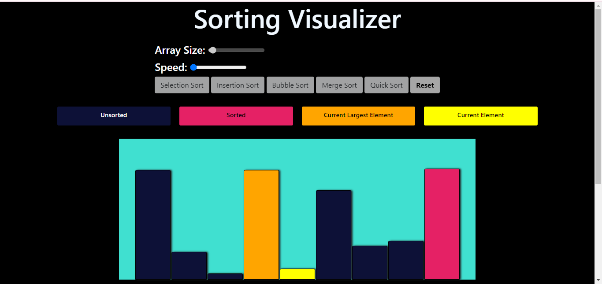

# sorting-visualizer

Welcome to the Sorting Visualizer! This project visualizes various sorting algorithms, helping you understand how they work step-by-step.

## Table of Contents

- [Introduction](#introduction)
- [Features](#features)
- [Demo](#demo)
- [Installation](#installation)
- [Usage](#usage)
- [Supported Algorithms](#supported-algorithms)
- [Contributing](#contributing)
- [License](#license)

## Introduction

Sorting Visualizer is a web application that demonstrates different sorting algorithms visually. It provides an educational tool for understanding the mechanics and efficiency of various sorting techniques.

## Features

- Visual representation of sorting algorithms
- Adjustable speed and size of the array
- Step-by-step execution of the sorting process
- Interactive user interface

## Demo

[Live Demo](https://iam-mohammedtaha.github.io/sorting-visualizer/)



## Installation

To run this project locally, follow these steps:

1. Clone the repository:
   ```bash
   git clone https://github.com/iam-MohammedTaha/sorting-visualizer.git
   cd sorting-visualizer
   ```

2. Install the dependencies:
   ```bash
   npm install
   ```

3. Start the development server:
   ```bash
   npm start
   ```

## Usage

1. Open your web browser and go to `http://localhost:3000`
2. Choose a sorting algorithm from the dropdown menu
3. Adjust the array size and sorting speed using the sliders
4. Click "Start" to begin the visualization
5. Watch the sorting process unfold step-by-step

## Supported Algorithms

- Bubble Sort
- Selection Sort
- Insertion Sort
- Merge Sort
- Quick Sort
- Heap Sort

## Contributing

Contributions are welcome! If you have any suggestions or improvements, feel free to create an issue or submit a pull request.

1. Fork the repository
2. Create a new branch:
   ```bash
   git checkout -b feature/your-feature
   ```
3. Make your changes and commit them:
   ```bash
   git commit -m "Add some feature"
   ```
4. Push to the branch:
   ```bash
   git push origin feature/your-feature
   ```
5. Open a pull request

## License

This project is licensed under the MIT License. See the [LICENSE](LICENSE) file for details.
```

Feel free to modify the content to better fit your project's specifics, such as adding more details about the algorithms, customizing the installation instructions, or updating the demo link and screenshot.
